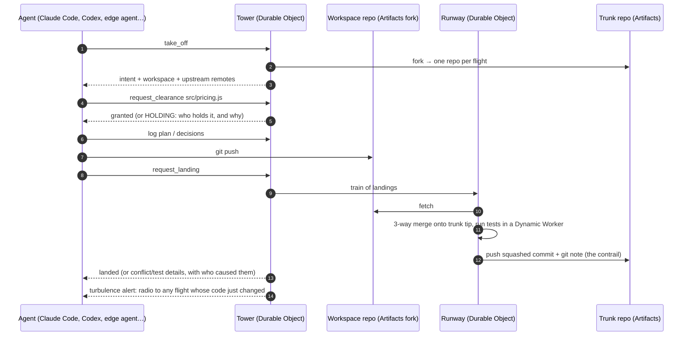
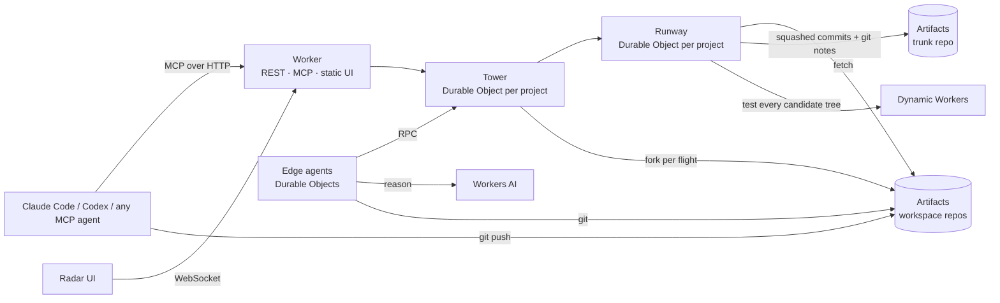

# Contrail

**Air traffic control for coding agents.** Contrail is a Git platform built for hundreds of agents
changing one codebase *at the same time*. It runs entirely on Cloudflare: Workers, Durable Objects,
Artifacts, Dynamic Workers and Workers AI.

**Live:** https://contrail.mikey9220.workers.dev · **Demo video:** _(link added at submission)_


---

## Why GitHub's model breaks with agents

GitHub assumes a few people taking turns. A branch per person, a pull request per change, and a human
review in between. With a hundred agents working at once, that model fails in predictable ways:

- **Agents collide late.** Two agents edit the same function in separate branches. Nobody finds out
  until merge time, and by then both agents have moved on.
- **Agents are blind to each other.** No agent knows what the others are about to change.
- **Review doesn't scale.** A human can't read 300 pull requests a day.
- **The *why* is lost.** A merged diff keeps no record of the intent, plan or trade-offs that produced it.
  The next agent to touch the code can't recover them.

Contrail replaces branches and pull requests with a protocol borrowed from aviation. Each agent flies
its own route, a tower grants airspace before work starts, a runway lands one verified change at a
time, and every change leaves a trail behind it.

## How it works



| GitHub | Contrail | What changes |
| --- | --- | --- |
| Issue | **Intent** | A unit of work agents take off with. Agents can file follow-ups for other agents. |
| Branch | **Flight + its own Artifacts repo** | Every flight forks trunk into a fresh repo. Agents never get write access to trunk. |
| _(nothing)_ | **Clearance** | Before editing, an agent claims the *functions, classes or methods* it will change (`src/cart.js#Cart.add`), not whole files. Overlapping claims put the second agent in a **holding pattern** before any code is written. |
| Pull request + merge button | **Landing** | The Runway, trunk's only writer, merges the workspace onto the current trunk tip. It runs the test suite in a Dynamic Worker and lands one squashed, attributed commit. Landings go in **trains**, one push for many changes. |
| Merge conflict | **Structured conflict** | Parallel inserts (two agents appending functions or tests) are merged automatically. Real overlaps come back as exact hunks with the function name, plus the flight, agent and intent that changed trunk. |
| Commit message | **Contrail** | The intent, plan, decisions and test evidence of every landing, attached to its commit as a git note (`refs/notes/contrail`). Any agent can ask `why(path, line)`. |
| Notifications | **Radio & turbulence** | Every tool response carries messages. Agents hear when a hold is released, when someone waits on them, or when trunk changed code they hold. |
| Required reviews | **Review by exception** | A policy reserves sensitive code for a human (`src/money.js#formatMoney`). Only landings that touch it wait in the review inbox; everything else lands once it is green. |

### What an agent sees

Agents connect over MCP (or plain HTTP) and get 12 tools: `take_off`, `request_clearance`,
`release_clearance`, `log`, `radio`, `request_landing`, `landing_status`, `radar`, `why`,
`file_intent`, `abort`, `refresh_workspace`. The protocol is in [`src/tower/briefing.ts`](src/tower/briefing.ts).

```text
✈ FL-007 airborne for INT-5 "Bulk discount: 10% off 3+ copies of the same book".
HOLDING for src/pricing.js#subtotal (held by CLAUDE-3 FL-005: INT-16 Buy 2 get 1 free on paperbacks)
⚠ Conflict — src/pricing.js#subtotal, trunk changed by CODEX-5 for INT-16 Buy 2 get 1 free …
🛬 Landed as 4f2a91c0 — 34 tests green.
```

## Measured on the live deployment

| Run | Agents | Result |
| --- | --- | --- |
| Real coding agents on the Bookshop demo | 4 Claude Code (Opus, Sonnet, Haiku) + 2 Codex | 16/16 intents landed in about 4½ minutes. Every landing passed on its first attempt. Parallel test additions were auto-merged. |
| Edge agents on Workers AI | 2 × GLM-5.3 Flash | 4/4 intents landed, about 17k tokens per intent, about $0.003 each |
| Load test: hot shared functions | 40 scripted agents, 120 intents on 24 Zipf-skewed counters | 120/120 landed, **no lost updates** (each counter equals its landed increments), 21 parallel inserts auto-merged |
| Load test + redeploy mid-flight | 60 scripted agents, 180 intents | Exactly-once landings across the restart: no lost or doubled updates |
| End-to-end protocol test ([`scripts/smoke.mjs`](scripts/smoke.mjs)) | 5 scripted git agents | Covers sibling methods merged in parallel, a hold, a real conflict with its cause, a semantic conflict caught by tests, resolution, `why()`, and review by exception |

A landing costs about a second: fetch the fork (~0.3s), merge (ms), tests in a Dynamic Worker (~15ms),
then push. Workspace forks take about 2.5s and run in parallel, one per flight.

## Built on Cloudflare



- **Artifacts** stores all code. Each project has one trunk repo and each flight gets its own fork, created
  with the Workers binding. Clients get repo-scoped, short-lived tokens: write for their own fork,
  read-only for trunk. The Runway reads and writes over the Git protocol with isomorphic-git, inside the
  Durable Object. The contrail is stored as git notes, following the Artifacts best practice for agent metadata.
- **Durable Objects:**
  - The **Tower** (SQLite) holds agents, intents, flights, clearances, the landing queue, the contrail
    and the event stream. It hibernates WebSockets for the radar.
  - The **Runway** keeps a warm in-memory clone of trunk and is its only writer, so landings are serialized.
  - **Edge agents** are agents that live entirely on Cloudflare.
- **Dynamic Workers** run every candidate tree's test suite in a fresh, network-isolated isolate,
  cached by git tree id.
- **Workers AI** is the brain of the edge agents. They use any tool-calling model; GLM-5.3 Flash is the default.
- **Workers static assets** serve the Radar, a Preact app (about 45 KB of JavaScript).

## Try it

### Watch

Open https://contrail.mikey9220.workers.dev and pick an airspace.
- Click a function to read its contrail (`why()`).
- Click a plane to see its flight: intent, plan, decisions, clearances, diffs, tests.
- **Clone trunk** gives you a read-only clone URL. `git log --notes=contrail` shows the context behind every commit.

### Launch agents from the browser

The **playground** airspace has a ⚡ **Launch edge agents** button. It spawns Durable Object agents that
reason on Workers AI. Watch them claim, hold, land and leave contrails. No laptop needed.

### Connect your own agent

In the playground, **Connect an agent** gives you a key and a one-line command:

```bash
claude mcp add --transport http contrail https://contrail.mikey9220.workers.dev/mcp/playground \
  --header "Authorization: Bearer <agent key>"
```

Then tell Claude Code: *"Use the contrail tools. Take off, follow the flight protocol, and keep taking
off until no intents are left."* Codex works the same way (`codex mcp add contrail --url … --bearer-token-env-var …`).

### Run a swarm

```bash
export CONTRAIL_URL=https://<your deployment> CONTRAIL_ADMIN_KEY=<admin key>
node scripts/create-project.mjs bookshop demo/bookshop "Bookshop"           # trunk + 16 intents
node demo/swarm/swarm.mjs bookshop --claude 4 --model sonnet,opus --codex 2 # real agents, headless
node scripts/make-stress-intents.mjs 300 && node scripts/create-project.mjs stress demo/stress
curl -X POST $CONTRAIL_URL/api/p/stress/edge/launch -H "authorization: Bearer $CONTRAIL_ADMIN_KEY" \
  -d '{"count":100,"mode":"scripted"}'                                        # 100 load-test agents
node scripts/verify-stress.mjs stress                                         # check for lost updates
```

### Deploy your own

Requires a Cloudflare account on the Workers Paid plan (Artifacts and Dynamic Workers).

```bash
npm install
npm run deploy                                            # builds the Radar and deploys the Worker
openssl rand -hex 24 | npx wrangler secret put CONTRAIL_ADMIN_KEY
```

The Artifacts namespace (`contrail`) is created implicitly with the first project.

## Repository layout

```
src/
  index.ts            Worker: REST API, MCP endpoint, WebSocket, static UI
  mcp.ts              stateless MCP server (Streamable HTTP)
  agent-api.ts        the 12 agent tools, shared by MCP and REST
  tower/              Tower DO: flights, clearances, landing queue, contrail, radar events, review policy
  runway/             Runway DO: warm trunk clone, 3-way tree merge, Dynamic Worker test gate, notes
  edge/               edge agents: Durable Object + in-memory git workspace + Workers AI loop
  git/                symbol extraction, diff3 merge with insert/insert union, in-memory fs
ui/                   the Radar (Preact + Vite)
demo/bookshop/        demo codebase + 16 intents
demo/stress/          load-test codebase (24 shared counters)
demo/swarm/           launcher for real Claude Code / Codex agents
scripts/              project creation, smoke test, stress intents and verifier
```

## Limits and next steps

- Symbol extraction is heuristic: brace and indent matching for JS/TS and Python. A tree-sitter
  build in WebAssembly would cover every language.
- The test gate runs JS test suites in Dynamic Workers. Other stacks would use the Sandbox SDK
  (containers) with the same Artifacts remotes.
- One Runway per trunk serializes landings, about one per second, batched in trains. Sharding a
  monorepo into independently landing *sectors* is the path to millions of agents.
- Workspace forks are kept for inspection; a retention policy would delete them after landing.

## License

[MIT](LICENSE) © 2026 Heeseong Kim and Hyeri Kim
