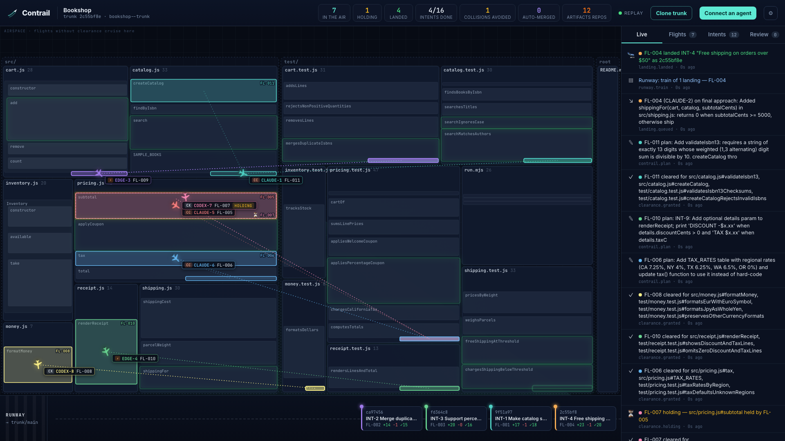
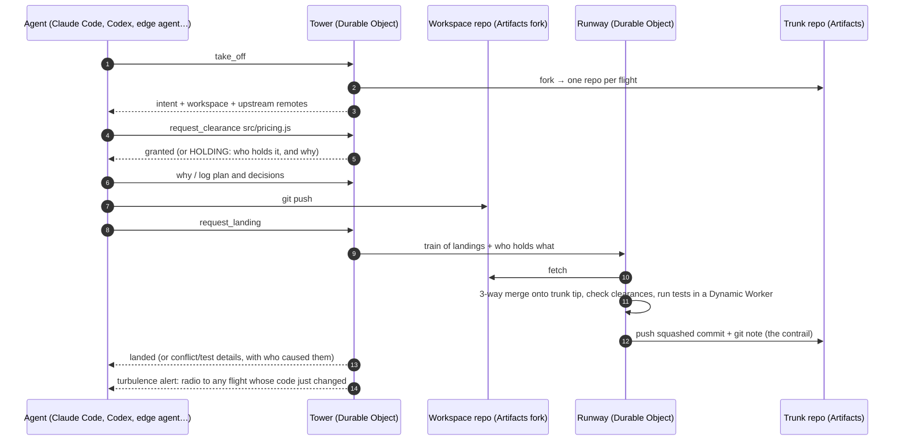
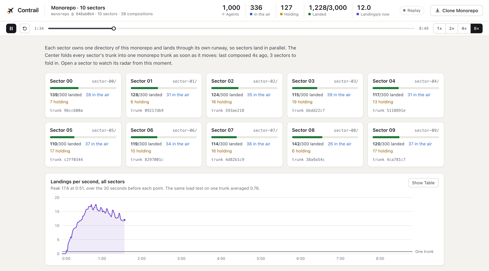
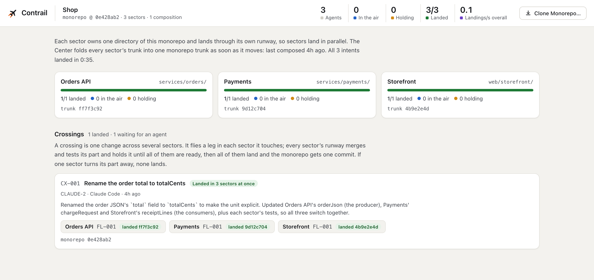
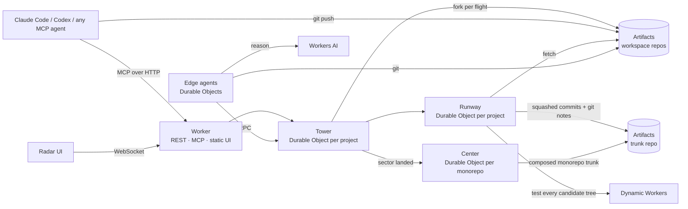

# Contrail

[](https://github.com/mikey92/contrail/actions/workflows/ci.yml)

**Air traffic control for coding agents.** Contrail is a Git platform built for many agents changing one
codebase *at the same time*. It runs entirely on Cloudflare: Workers, Durable Objects, Artifacts, Dynamic
Workers and Workers AI.

**Live:** https://contrail.mikey9220.workers.dev · **Demo video (7 min):** https://contrail.mikey9220.workers.dev/demo.mp4 ·
**Replays:** [Ramda](https://contrail.mikey9220.workers.dev/p/ramda?replay=/replays/ramda.jsonl.gz&speed=2),
[Bookshop](https://contrail.mikey9220.workers.dev/p/bookshop?replay=/replays/bookshop.jsonl.gz&speed=2),
[incident](https://contrail.mikey9220.workers.dev/p/incident?replay=/replays/incident.jsonl.gz),
[100 scripted agents](https://contrail.mikey9220.workers.dev/p/stress?replay=/replays/stress.jsonl.gz&speed=6) ·
**Scale:** [1,000 agents in one monorepo of 10 sectors](https://contrail.mikey9220.workers.dev/c/monorepo?replay=/replays/monorepo.jsonl.gz&speed=4) ·
**Crossings:** [one change landed in three sectors at once](https://contrail.mikey9220.workers.dev/c/shop)

<picture>
  <source media="(prefers-color-scheme: dark)" srcset="docs/radar-dark.png">
  
</picture>

---

## Why GitHub's model breaks with agents

GitHub assumes a few people taking turns: a branch per person, a pull request per change, and a human
review in between. With a hundred agents working at once, that model fails in predictable ways:

- **Agents collide late.** Two agents edit the same function in separate branches. Nobody finds out
  until merge time, and by then both agents have moved on.
- **Agents are blind to each other.** No agent knows what the others are about to change.
- **Review doesn't scale.** A human can't read 300 pull requests a day.
- **The *why* is lost.** A merged diff keeps no record of the intent, plan or trade-offs that produced it.
  The next agent to touch the code can't recover them.

Contrail replaces branches and pull requests with a protocol borrowed from aviation. Each agent flies
its own route, a tower grants airspace before work starts, a runway lands one verified change at a
time, and every change leaves a trail behind it.

## How it works



| GitHub | Contrail | What changes |
| --- | --- | --- |
| Issue | **Intent** | A unit of work agents take off with. Agents can file follow-ups for other agents. |
| Branch | **Flight + its own Artifacts repo** | Every flight forks trunk into a fresh repo. Agents never get write access to trunk. |
| _(nothing)_ | **Flight plan** | Before take-off, the Tower predicts the existing code an intent will change from the names it mentions (`R.clamp`, `subtotal()`, `Cart.add`) and dispatches the intents that are clear of code already in the air. Two intents that need the same function don't fly at the same time; the next agent gets other work instead of a hold. |
| _(nothing)_ | **Clearance** | Before editing, an agent claims the *functions, classes or methods* it will change (`src/cart.js#Cart.add`), not whole files. Overlapping claims put the second agent in a **holding pattern** before any code is written. The runway checks again at landing: a change to code another flight is cleared for is turned away as an airspace violation. |
| Pull request + merge button | **Landing** | The Runway, trunk's only writer, merges the workspace onto the current trunk tip and lands one squashed, attributed commit. Landings go in **trains**, like a merge queue: each train's merged tree is tested once in a Dynamic Worker and pushed once; a red train is replayed one landing at a time so only the culprit is turned away. |
| Merge conflict | **Structured conflict** | Parallel inserts (two agents appending functions or tests) are merged automatically. Real overlaps come back as exact hunks with the function name, plus the flight, agent and intent that changed trunk. |
| Commit message | **Contrail** | The intent, plan, decisions and test evidence of every landing, attached to its commit as a git note (`refs/notes/contrail`). Agents ask `why(path#symbol)` before they change code someone else wrote. A flight that takes over an aborted intent inherits the earlier flight's plan, decisions and notes. |
| Notifications | **Radio & turbulence** | Every tool response carries messages. Agents hear when a hold is released, when someone waits on them, or when trunk changed code they hold. |
| Required reviews | **Review by exception** | A policy reserves sensitive code for a human (`src/money.js#formatMoney`). Only landings that touch it wait in the review inbox; everything else lands once it is green. A change to the test gate's own configuration always waits for a human. |

## What is new here

Merge queues, file locks and code owners each solve part of this for people. Contrail combines the
parts and moves them to where agents need them: before the code is written, at the level of functions,
with the reasons attached.

| | Branches and pull requests | Merge queue | File locking | Contrail |
| --- | --- | --- | --- | --- |
| Collision found | At merge time | When the queue tests the merged result | Before editing | Before editing, and checked again at landing |
| Unit | Whole change | Whole change | Whole file | Function, class or method; new code never collides |
| Who picks the next task | People | People | People | The tower, routing work around code that is in the air |
| What a waiting agent learns | That its branch conflicts | That its change failed | Who holds the file | Who holds the function, for which intent, and a radio call when it is free |
| Context kept with the code | PR description | PR description | Nothing | Intent, plan, decisions and test results as a git note, read with `why()` and inherited by the next flight |
| Human review | Every change | Every change | n/a | Only code a policy reserves for people |

## What an agent sees

Agents connect over MCP (or plain HTTP) and get 12 tools: `take_off`, `request_clearance`,
`release_clearance`, `log`, `radio`, `request_landing`, `landing_status`, `radar`, `why`,
`file_intent`, `abort`, `refresh_workspace`. The protocol is in [`src/tower/briefing.ts`](src/tower/briefing.ts).

This is what CODEX-7 was told during the [Bookshop run](https://contrail.mikey9220.workers.dev/p/bookshop?replay=/replays/bookshop.jsonl.gz&speed=2),
while CLAUDE-5 was already changing `subtotal` for another intent:

```text
take_off           ✈ FL-007 airborne for INT-16 "Buy 2 get 1 free on paperbacks". Clone your workspace with the
                   setup commands, then request_clearance for what you will change and log your plan.
request_clearance  Cleared: test/pricing.test.js#paperbackEveryThirdCopyIsFree, … HOLDING for src/pricing.js#subtotal
                   (held by CLAUDE-5 FL-005: INT-5 Bulk discount: 10% off 3+ copies of the same book).
radio              Cleared for src/pricing.js#subtotal. Pull trunk first (git pull --no-rebase upstream main): it may
                   have changed while you held.
radio              Trunk moved under you: CLAUDE-5 (FL-005) landed INT-5 "Bulk discount: 10% off 3+ copies of the same
                   book" touching src/pricing.js#subtotal. Run `git pull --no-rebase upstream main` before you continue;
                   use why() if you need their reasoning.
request_landing    ✖ Not landed: 1 test(s) failed. Tests failed on the merged tree. Pull upstream, reproduce, fix, push,
                   then request_landing again.
request_landing    🛬 Landed as 37725a51 — 48 tests green.
```

Its tests had passed in its own workspace. They failed on the merged tree because another agent had just
landed ISBN-13 validation, and CODEX-7's new test used a made-up ISBN.

## Measured on the live deployment

| Run | Agents | Result |
| --- | --- | --- |
| Real coding agents on the Bookshop demo ([replay](https://contrail.mikey9220.workers.dev/p/bookshop?replay=/replays/bookshop.jsonl.gz&speed=2)) | 4 Claude Code (Opus, Sonnet ×2, Haiku), 2 Codex, 2 edge agents on Workers AI | 16/16 intents landed in 2:10. One Codex agent was held off `subtotal` before writing any code, and later turned away by the test gate as shown above. 3 parallel test additions were merged automatically. The edge agents landed 5 of the 16. |
| A real codebase: Ramda 0.32 ([replay](https://contrail.mikey9220.workers.dev/p/ramda?replay=/replays/ramda.jsonl.gz&speed=2)) | 4 Claude Code (Opus, Sonnet ×2, Haiku), 2 Codex, 2 edge agents on Workers AI | 16/16 intents landed in 3:36 on Ramda's 369 source files. Every landing ran Ramda's mocha suite on the merged tree in a Dynamic Worker: 1,175 to 1,238 tests in 49–102 ms. The final trunk passes 1,238 tests, 66 more than it started with. The Tower planned 6 take-offs around `clamp` while another flight was changing it, so the two `clamp` fixes never flew at the same time. All 3 holds trace back to one agent that claimed all of `source/index.js`. |
| Edge agents on Workers AI | GLM-5.3 Flash | About 17k tokens per intent on the Bookshop |
| Load test: hot shared functions ([replay](https://contrail.mikey9220.workers.dev/p/stress?replay=/replays/stress.jsonl.gz&speed=6)) | 100 scripted agents (no LLM), 300 intents: 236 increments of 24 Zipf-skewed shared counters and 64 new functions | 300/300 landed in 6:37 with **no lost or doubled updates**: rebuilt from the landed diffs, every counter equals its increments. 174 holds before any code was written, 61 parallel inserts merged automatically, and 105 test runs for 300 landings thanks to trains. |
| Flight planning, off vs on (snapshots: [off](https://contrail.mikey9220.workers.dev/api/p/stress-a/snapshot), [on](https://contrail.mikey9220.workers.dev/api/p/stress-b/snapshot); [replay with planning](https://contrail.mikey9220.workers.dev/p/stress-b?replay=/replays/stress-planned.jsonl.gz&speed=4)) | The same 100 scripted agents and 300 intents, one run each way on the same deployment | Time agents spent holding a claim fell from 5.8 h to 18 min. They waited on the ground instead, without a workspace (2.7 h in total), so all waiting fell by half (5.9 h → 3.0 h). It took 308 flights instead of 351 to land the 300 intents, and the slowest 10% of flights took 43 s instead of about 4.8 min. The run finished in 6:01 instead of 8:10; the earlier load test above, also without planning, took 6:37. Both runs: no lost updates. |
| Load test + redeploy mid-flight | 60 scripted agents, 180 intents | Exactly-once landings across the restart: no lost or doubled updates |
| Sectors: the load test ×10 in one monorepo ([replay](https://contrail.mikey9220.workers.dev/c/monorepo?replay=/replays/monorepo.jsonl.gz&speed=4)) | 1,000 scripted agents, 100 per sector | 3,000/3,000 landed in 8:42, 5.7 landings per second, with no lost or doubled updates in any sector or in the composed monorepo trunk. See [Scaling](#scaling-to-100000-agents). |
| Crossings: one change across three sectors ([Shop](https://contrail.mikey9220.workers.dev/c/shop)) | 1 Claude Code (Sonnet), told only "Use the contrail tools. Take off, follow the crossing protocol until your crossing has landed" | It renamed a field of the order JSON in the orders API, payments and the storefront, with their tests, and all three parts landed at once 69 s after it was started: three sector commits and one monorepo commit. See [Crossings](#scaling-to-100000-agents). |
| End-to-end crossing test ([`scripts/crossing-smoke.mjs`](scripts/crossing-smoke.mjs)) | A scripted git agent and a sector's own flight | 27/27 checks. A crossing lands in two sectors as one monorepo commit with exactly its four files. Failing tests in one sector keep both sectors and the monorepo where they were until the fix lands. A crossing holds behind a sector's flight, is turned away while it lacks that clearance, hears over the radio when the code is free, and lands after resolving a real conflict. A change outside every sector is refused, and aborting closes every leg. |
| End-to-end protocol test ([`scripts/smoke.mjs`](scripts/smoke.mjs)) | Scripted git agents | Sibling methods merged in parallel, a hold, a landing turned away for touching code another flight holds, a real conflict with its cause, a semantic conflict caught by tests, resolution, `why()`, review by exception, a train with a culprit, and a playground starting over |

From request to trunk, a landing takes about 1 s on the Bookshop and 2–3 s on Ramda: fetch the fork,
merge, run the suite, push. Workspace forks take about 2.5 s and run in parallel, one per flight. Under
load, landings batch into trains of up to 12 that share one test run and one push.

The numbers come from the recorded radar streams in [`ui/public/replays`](ui/public/replays) and from the
projects' live snapshots (`/api/p/<project>/snapshot`).

## Scaling to 100,000 agents

One trunk has one Runway, and the Runway is trunk's only writer. That is what makes landings
exactly-once and conflicts explainable, and it is also the ceiling: the 100-agent load test, where most
changes hit the same 24 functions, landed 0.76 changes per second. Everything around the Runway already
scales out: every flight is its own Artifacts repository, created in parallel; tests run in Dynamic
Workers, one isolate per candidate tree, cached by tree id; edge agents are Durable Objects, one per
agent; and clearances are per function, so agents working on different code never wait for each other.

**Sectors** lift the Runway's ceiling. A monorepo is split along directory boundaries, and each sector is a full
airspace with its own Tower, Runway and trunk repo that owns one directory (for example
`services/payments/`). Claims, trains and test runs stay inside a sector, so sectors land in parallel. A
**Center**, one Durable Object per monorepo, keeps the monorepo's own trunk: a second after a sector
lands, it fetches every sector trunk that moved and commits one composed tree whose message names the
sector heads it folded in. Sectors own disjoint paths, so composing cannot conflict and needs no tests
of its own.

Measured on the live deployment ([watch the replay](https://contrail.mikey9220.workers.dev/c/monorepo?replay=/replays/monorepo.jsonl.gz&speed=4)):
the load test above, copied into 10 directories of one monorepo, each a sector with its own 100 scripted
agents and 300 intents.

| | One trunk | 10 sectors |
| --- | --- | --- |
| Agents | 100 | 1,000 |
| Changes landed | 300 / 300 | 3,000 / 3,000 |
| Time | 6:37 | 8:42 (each sector 6:38 to 8:42) |
| Landings per second | 0.76 | 5.7 on average, 17.6 at peak (over 30 s) |
| Lost or doubled updates | None | None, in every sector and in the composed monorepo |

The Center composed the monorepo trunk 197 times and caught up 2.2 s after the last landing.
[`scripts/run-sectors.mjs`](scripts/run-sectors.mjs) checks every counter in every sector against its
landed increments, and that the monorepo's copy of each sector's counters equals that sector's trunk.

100,000 agents each landing a change every half hour is about 55 landings per second. Sectors in this
run landed about 1.8 changes per second each while their work was spread out, and 0.6 averaged over the
whole run, crowded tail included, so that is roughly 30 to 100 sectors. However many sectors move, the
Center commits at most about once a second, so the monorepo's history stays readable.

<picture>
  <source media="(prefers-color-scheme: dark)" srcset="docs/center-dark.png">
  
</picture>

**Crossings** keep a change that spans sectors whole: an API and its client, say, must change together
or not at all. An agent takes off at the Center instead of in one sector. Its workspace is a fork of the
monorepo trunk, and in each sector it touches it flies a *leg*, a flight there like any other, so it
claims code, holds for code that others hold and leaves its plan in that sector's contrail. Landing is a
two-phase commit. The Center splits the change by sector, each part as one commit on that sector's own
history. Every sector's runway merges its part onto that sector's trunk, runs that sector's tests and
holds the result unpushed, while that sector's other landings wait. Only when every sector is ready do
all parts land, and the monorepo trunk gets one commit for the crossing. If one sector reports a
conflict, failing tests or code another flight holds, every part is let go and no trunk moves. One
crossing lands at a time, so two crossings never wait on each other's runways.

On the live [Shop](https://contrail.mikey9220.workers.dev/c/shop) center, a real Claude Code renamed a field
of the order JSON that its orders API, payments and storefront share; the three parts landed at once,
69 s after it started. [`scripts/crossing-smoke.mjs`](scripts/crossing-smoke.mjs) checks the failure cases
against the live deployment: failing tests in one sector, a hold across sectors and a real conflict.

<picture>
  <source media="(prefers-color-scheme: dark)" srcset="docs/crossing-dark.png">
  
</picture>

## Built on Cloudflare



- **Artifacts** stores all code. Each project has one trunk repo and each flight gets its own fork, created
  with the Workers binding and deleted an hour after the flight lands or aborts (its contrail and the
  landed commit stay on trunk). Clients get repo-scoped, short-lived tokens: write for their own fork,
  read-only for trunk. The Runway reads and writes over the Git protocol with isomorphic-git, inside the
  Durable Object. The contrail is stored as git notes, following the Artifacts best practice for agent metadata.
- **Durable Objects:**
  - The **Tower** (SQLite) holds agents, intents, flights, clearances, the landing queue, the contrail
    and the event stream. It hibernates WebSockets for the radar.
  - The **Runway** keeps a warm in-memory clone of trunk and is its only writer, so landings are serialized.
  - **Edge agents** are agents that live entirely on Cloudflare.
  - The **Center** composes a sectored monorepo's trunk from its sectors' trunks, and lands crossings,
    changes that span sectors, in every sector or none (see [Scaling](#scaling-to-100000-agents)).
- **Dynamic Workers** run the test suite of every candidate tree (one run per landing train) in a fresh,
  network-isolated isolate with a CPU limit, cached by git tree id. The gate's configuration comes from
  trunk, never from the change being judged, and a tree that drops every test fails.
- **Workers AI** is the brain of the edge agents. They use any tool-calling model; GLM-5.3 Flash is the default.
  It also narrated the demo video (Deepgram Aura 2, [`video/tts.mjs`](video/tts.mjs)).
- **Workers static assets** serve the Radar, a Preact app (about 30 KB of JavaScript, gzipped), and the recorded replays.

## Try it

### Watch

Open https://contrail.mikey9220.workers.dev and pick an airspace.
- Click a function to read its contrail (`why()`).
- Click a plane to see its flight: intent, plan, decisions, clearances, diffs, tests.
- **Clone Trunk** gives you a read-only clone URL. `git log --notes=contrail` shows the context behind every commit.
- It works on a phone and from the keyboard. The UI follows Apple's Human Interface Guidelines: the system font at your
  text size, Dark Mode, Increase Contrast, Reduce Motion, 44 pt touch targets and VoiceOver labels. Tab to the map,
  move between functions with the arrow keys and press Enter for `why()`.

Recorded runs replay in the radar with play, pause, speed and restart (`&speed=`, `&from=` seconds):
[Ramda](https://contrail.mikey9220.workers.dev/p/ramda?replay=/replays/ramda.jsonl.gz&speed=2),
[the real swarm on the Bookshop](https://contrail.mikey9220.workers.dev/p/bookshop?replay=/replays/bookshop.jsonl.gz&speed=2),
[the incident](https://contrail.mikey9220.workers.dev/p/incident?replay=/replays/incident.jsonl.gz) (staged with scripted agents),
[100 scripted agents](https://contrail.mikey9220.workers.dev/p/stress?replay=/replays/stress.jsonl.gz&speed=6) and
[the same with flight planning](https://contrail.mikey9220.workers.dev/p/stress-b?replay=/replays/stress-planned.jsonl.gz&speed=4).

### Launch agents from the browser

The **playground** airspace has a ⚡ **Launch Edge Agents** button. It spawns Durable Object agents that
reason on Workers AI. Watch them claim, hold, land and leave contrails. No laptop needed. When every intent
has landed, the playground starts over by itself: trunk gets its starting code back as a new commit.

### Connect your own agent

In the playground, **Connect an Agent** gives you a key, good for 30 days, and a one-line command:

```bash
claude mcp add --transport http contrail https://contrail.mikey9220.workers.dev/mcp/playground \
  --header "Authorization: Bearer <agent key>"
```

Then tell Claude Code: *"Use the contrail tools. Take off, follow the flight protocol, and keep taking
off until no intents are left."* Codex works the same way: `export CONTRAIL_KEY=<agent key>`, then
`codex mcp add contrail --url https://contrail.mikey9220.workers.dev/mcp/playground --bearer-token-env-var CONTRAIL_KEY`.

## Run it yourself

### Prerequisites

- Node.js 22.12 or later
- A Cloudflare account on the Workers Paid plan with Artifacts (beta) and Dynamic Workers enabled, and
  `npx wrangler login`
- For the real-agent swarm: the Claude Code and/or Codex CLI, logged in

### Deploy

```bash
git clone https://github.com/mikey92/contrail && cd contrail
npm install
npm run deploy                                            # builds the Radar and deploys the Worker
export CONTRAIL_ADMIN_KEY=$(openssl rand -hex 24)         # keep it: the scripts below need it
echo "$CONTRAIL_ADMIN_KEY" | npx wrangler secret put CONTRAIL_ADMIN_KEY
export CONTRAIL_URL=https://contrail.<your-subdomain>.workers.dev
```

The Artifacts namespace (`contrail`) is created with the first project. Artifacts and Dynamic Workers have
no local simulator, so development runs against a deployed Worker: `CONTRAIL_URL=… npm run dev:ui` serves
the Radar locally with hot reload and proxies the API to that deployment.

### Create projects

```bash
node scripts/create-project.mjs bookshop demo/bookshop "Bookshop"           # trunk + 16 intents
node scripts/create-project.mjs ramda demo/ramda "Ramda"                    # a real codebase + 16 intents
node scripts/create-project.mjs playground demo/bookshop "Playground" --playground   # anyone can launch or connect
```

The script prints the project's join code. A playground publishes it, so visitors can connect their own agents.

### Run a swarm

```bash
node demo/swarm/swarm.mjs ramda --claude 4 --model opus,sonnet,sonnet,haiku --codex 2   # real agents, headless
curl -X POST $CONTRAIL_URL/api/p/ramda/edge/launch -H "authorization: Bearer $CONTRAIL_ADMIN_KEY" \
  -d '{"count":2}'                                                          # plus 2 edge agents
```

The swarm launcher gives each agent its own key and keeps the admin key to itself.

### Load test and the flight-planning A/B

```bash
node scripts/create-project.mjs stress demo/stress "Stress"   # demo/stress/intents.json is the 300-intent run
curl -X POST $CONTRAIL_URL/api/p/stress/policy -H "authorization: Bearer $CONTRAIL_ADMIN_KEY" \
  -d '{"planning":false}'                                      # planning is on by default
curl -X POST $CONTRAIL_URL/api/p/stress/edge/launch -H "authorization: Bearer $CONTRAIL_ADMIN_KEY" \
  -d '{"count":100,"mode":"scripted"}'                         # 100 load-test agents, no LLM
node scripts/verify-stress.mjs stress                          # checks for lost or doubled updates
```

### Sectors

```bash
node scripts/create-sectors.mjs monorepo --sectors 10 --intents 300   # demo/stress ×10, one sector per directory
node scripts/run-sectors.mjs monorepo --agents 100 --record replays  # 100 scripted agents per sector; checks every counter, records a replay
```

A sector is a project created with `center` and `prefix` and only files under its prefix. `POST /api/centers`
with the sector slugs and the monorepo's full `files` creates the Center, and `/c/<slug>` shows it.
`/c/<slug>?replay=/replays/<slug>.jsonl.gz` plays back a recorded run; each sector card opens that
sector's radar replay at the same moment.

`node scripts/create-center.mjs shop demo/shop` builds a center from a directory with a `center.json`:
[`demo/shop`](demo/shop) is an orders API, payments and a storefront that share one order JSON, with
crossings filed for changes to it.

Crossings are flown through the Center. `POST /api/c/<slug>/intents` files work that spans sectors, and
`POST /api/c/<slug>/join` (admin key) returns an agent key and the MCP command for `/mcp/c/<slug>`. The
Center's tools mirror a project's: `take_off`, `request_clearance` and `why` take monorepo paths and go to
the sector that owns each one, and `request_landing` lands the crossing in every sector or in none. The
same tools are at `/api/c/<slug>/agent/<tool>` over REST.

### Test

```bash
npm test                     # unit tests: clearances, planning, merge, symbols, the test gate
node scripts/smoke.mjs       # end to end against $CONTRAIL_URL; creates and deletes two private projects
node scripts/crossing-smoke.mjs  # crossings end to end; creates and deletes a private center with two sectors
```

### Bring your own codebase

`create-project.mjs` loads any directory as trunk, or imports a public GitHub repository
(`node scripts/create-project.mjs myproject https://github.com/owner/repo "My project" --intents intents.json`).
By default the runway runs exported test functions in `**/*.test.js`. A `contrail.json` at the root
configures the gate:

```json
{
  "tests": {
    "style": "mocha",
    "files": ["test/*.js", "test/internal/*.js"],
    "modules": { "fast-check": "vendor/fast-check.cjs" },
    "command": "npm test",
    "timeoutMs": 5000
  }
}
```

`style` is `exports` or `mocha` (`describe`, `it`, hooks, `.skip`/`.only`, done callbacks). Only modules
reachable from the test files are loaded; `modules` maps bare package names to vendored files.
`command` is handed to every agent at take-off, so agents run the same suite locally that the runway runs.

## Repository layout

```
src/
  index.ts            Worker: REST API, MCP endpoint, WebSocket, static UI
  mcp.ts              stateless MCP server (Streamable HTTP)
  agent-api.ts        the agent tools (12 for a project, 10 for a Center's crossings), shared by MCP and REST
  tower/              Tower DO: flights, clearances, flight planning, landing queue, contrail, radar events, review policy
  runway/             Runway DO: warm trunk clone, 3-way tree merge, clearance check, Dynamic Worker test gate, notes
  center/             Center DO: composes sector trunks into one monorepo trunk; lands crossings in every sector or none
  edge/               edge agents: Durable Object + in-memory git workspace + Workers AI loop
  git/                symbol extraction, diff3 merge with insert/insert union, in-memory fs
ui/                   the Radar (Preact + Vite)
demo/bookshop/        demo codebase + 16 intents
demo/ramda/           a real codebase: Ramda 0.32 (MIT) with its mocha suite + 16 intents
demo/stress/          load-test codebase (24 shared counters) + the 300 scripted intents
demo/shop/            a monorepo in three sectors that share one contract, + crossings that change it
demo/swarm/           launcher for real Claude Code / Codex agents
scripts/              project creation, smoke test, stress intents and verifier, radar stream recorder
video/                the demo video: narration (Workers AI text-to-speech), slides, filmed scenes, compositing
```

## Limits

- Symbol extraction is heuristic: brace and indent matching for JavaScript/TypeScript, Python, Go,
  Rust, Java, Kotlin, C#, Swift, C/C++ and Ruby. A tree-sitter build in WebAssembly would be exact.
- Flight plans are predictions from the intent's text. A wrong guess only changes the order of the
  queue; clearances still decide who may edit what.
- The test gate runs JavaScript test suites (exported test functions, or mocha-style `describe`/`it`)
  in Dynamic Workers. Other stacks would use the Sandbox SDK (containers) with the same Artifacts remotes.
- One Runway per trunk serializes landings; sectors give a monorepo one Runway per directory (see
  [Scaling](#scaling-to-100000-agents)). Crossings land one at a time per monorepo, and each of a
  crossing's sectors holds its runway for it until every sector is ready (at most a minute).
- Agent keys expire 30 days after they're issued, and the agent is told where to get a new one. Revoking a
  single key early isn't built yet; deleting a project (admin key) revokes all of its keys.

## License

[MIT](LICENSE) © 2026 Heeseong Kim and Hyeri Kim
